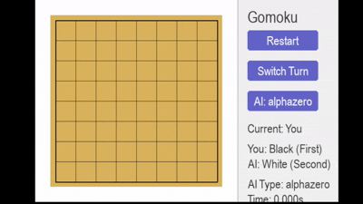

# Gomoku Deep Reinforcement Learning

## Introduction
This project implements Gomoku (Five in a Row) AI using deep reinforcement learning, featuring DQN and AlphaZero methodologies.

## Demo


## Features
- DQN reinforcement learning algorithm
- Minimax search with alpha-beta pruning
- AlphaZero-style Monte Carlo Tree Search
- Human vs AI interface
- AI performance comparison

## Installation
```bash
git clone https://github.com/scyzp3/DIA_cw.git
cd DIA_cw
pip install -r requirements.txt
```

## Usage

### Play against AI
```bash
python gui.py --ai alphazero --model_file models/best_policy.model
```

### Compare AI Algorithms
```bash
python compare.py --n_games 10
```

### Train Model
```bash
python train.py --board_size 8 --n_in_row 5
```

## Project Structure
- `mcts/`: Monte Carlo Tree Search implementation (based on external work)
- `minmax/`: Minimax algorithm implementation (original contribution)
- `gui.py`: Graphical user interface (original contribution)
- `compare.py`: AI comparison script (original contribution)
- `train.py`: Model training script (original contribution)
- `demo/`: Contains demonstration files including GUI demo

## Contributions
Only the content in the `mcts/` directory is based on the project [AlphaZero_Gomoku](https://github.com/junxiaosong/AlphaZero_Gomoku.git) by junxiaosong. All other components, including the GUI interface, Minimax implementation, comparison tools, and DQN integration, are original contributions.